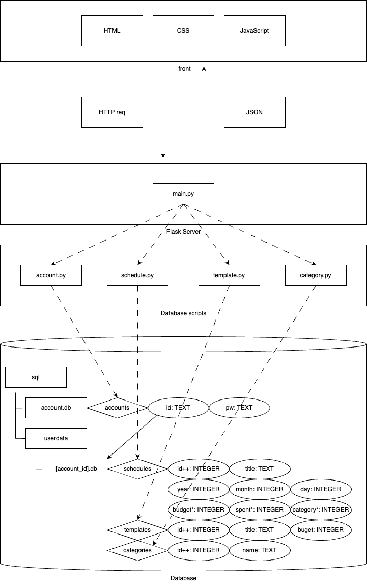

# W1 PBL概論
カレンダー x 家計簿アプリ  
PBL概論 水曜日 5限 W1  

# サンプル(srv接続無し)
ID: sample  
PW: sample00  

# 環境
- バックエンド
  - python 3.9 以降
  - flask
  - flask-cors
  - gunicorn
- フロントエンド
  - chrome

# デプロイ先
環境構築なしでサービスが使えます。  
バックエンドのデプロイ先(Render)は無料プランの為、15分アクセスが無いとサーバーがダウンします(サーバーダウン後、アクセスには1分ほどかかります)。  
バックエンド -> [Render](https://pbl-w1.onrender.com/)  
フロントエンド -> [GitHub Pages](https://sibateku.github.io/PBL_W1/)

# システム構成図

# 完成したもの
1. アカウントログイン機能
2. アカウント登録機能
3. スケジュール表示機能
4. スケジュール登録機能
5. テンプレート機能(サーバー共有無し)

# 完成していないもの
1. スケジュール削除機能
2. テンプレートのサーバー共有機能

# Reference
https://zenn.dev/yutasb/articles/cb5b58e1ab6de8

# Flask HTTP requests (example)
== Account ==  
アカウント作成 (アカウントid, password指定)  
http://127.0.0.1:5000/account?req=create&id=jiro&password=jir0pas!  
アカウント削除 (アカウントid指定)  
http://127.0.0.1:5000/account?req=delete&id=jiro  
アカウント認証 (アカウントid, password指定)  
http://127.0.0.1:5000/account?req=auth&id=jiro&password=jir0pas!

== Schedule ==  
スケジュール取得 (アカウントid, year, month指定)  
http://127.0.0.1:5000/schedule?req=get&id=jiro&year=2024&month=11  
スケジュール追加 (アカウントid, year, month, day, title, *budget, *spent, *category指定)  
(budget, spent, category の指定がなければそれぞれ 0, 0, 0 が入る)  
(なお，category の 0 は __その他__ を表す)  
http://127.0.0.1:5000/schedule?req=set&id=jiro&year=2024&month=11&day=26&title=ご飯  
スケジュール削除 (アカウントid, スケジュールid指定)  
http://127.0.0.1:5000/schedule?req=delete&id=jiro&data_id=1  

== Template ==
テンプレートすべて取得 (アカウントid指定)  
http://127.0.0.1:5000/template?req=get&id=jiro  
テンプレート追加 (アカウントid, title, budget指定)  
http://127.0.0.1:5000/template?req=set&id=jiro&title=ご飯&budget=1000  

== Category ==  
カテゴリ取得 (アカウントid, カテゴリid指定)  
http://127.0.0.1:5000/category?req=get&id=jiro&category_id=1  
カテゴリすべて取得 (アカウントid指定)  
http://127.0.0.1:5000/category?req=getall&id=jiro  
カテゴリ追加 (アカウントid, title指定)  
http://127.0.0.1:5000/category?req=set&id=jiro&title=食費  
